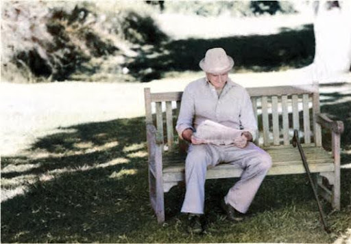
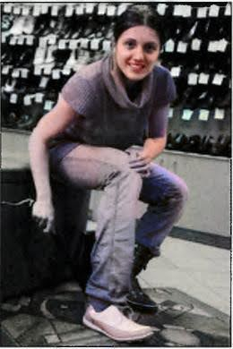
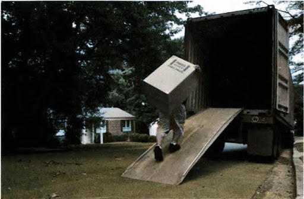

### Part 1: Write a Sentence Based on a Picture

Question 1

sit/on

Question 2

wind/hard

Question 3

if/fit

Question 4

while/phone

Question 5

box/heavy

### Part 2: Respond to an Email

Question 6

From: Sandra Smith
To: White Appliances
Subject: Unsatisfactory service
Sent: March 17th, 2:10 P.M.

White Appliances:
I'm writing to complain about the unsatisfactory service I received at your store. Two weeks ago, I purchased a newly launched model of washing machine. But; I found when I unpacked it that it had been damaged on the right side of the door. Also, when I was doing my laundry it automatically stopped and I couldn't get it to start again. So, I tried to call the repair center over 5 times, but I still haven't received any repair service. I think this is not a good way to treat customers. Please write back soon and let's discuss this matter.

Direction: Respond to the e-mail as if you are a worker at White Appliances. In your e-mail, give at least ONE explanation and make TWO compensations.

Question 7

From: Kangaroo Travel Agency
To: Potential traveler
Subject: It's time to travel!!!
Sent: November 3rd, 10:05 A.M.

We do Australia because we know Australia. Now it's time to talk to the Australia specialist and book your Christmas and New Year's holidays. Also, we're offering special deals to Sydney, Melbourne, and many more tourist attractions in Australia. Call 24 hours a day, 7 days a week. Please visit our Web site www.kangaroo.co.au. We hope to hear from you soon!

Direction: Respond to the e-mail as if you are a customer. In your e-mail, ask TWO questions about the travel packages and make ONE request.

### Part 3: Write an essay

Question 8

When it comes to workplace, we normally think we have to go there to work. A lot of us commute to work every day. However, there are some people who work remotely at their homes or away from their offices. What do you think is the reason why some companies permit their employees to work this way?
