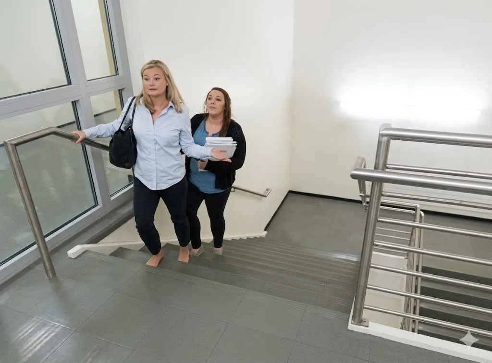
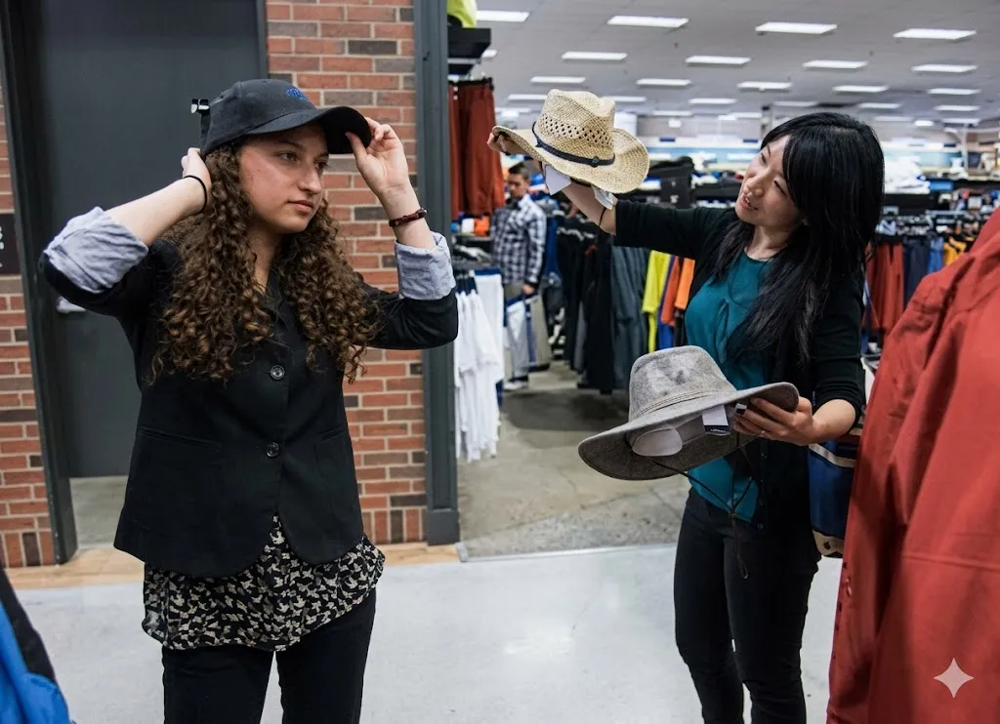

### Part 1: Write a Sentence Based on a Picture

Question 1

Climb/stair

Question 2

near/water

Question 3

cook/many

Question 4

because/heavy

Question 5

try on/before

### Part 2: Respond to an Email

Question 6

From: Liza Aluko
To: Library members
Subject: Volunteers needed for book sale
Sent: August 8, 2:01 P.M.

Our library is looking for volunteers to help with the book sale coming up this weekend. We need individuals to help in all areas. If you're interested, please tell us how you'd like to help with the book sale. Let me know if you have any questions.

Direction: Respond to the e-mail. In your e-mail, give one piece of information and ask TWO questions.

Question 7

From: John Dembo, TMR Industries 
To: Susan Hoffman, TMR Industries
Subject: Employee awards dinner
Sent: April 5, 6:00 P.M.

Hi Susan,
I'm coordinating the employee awards dinner this year. I know you've done this in the past. Can you tell about your experience planning previous dinners? Also, l'd appreciate any suggestions that you may have.
John Dembo

Direction: Respond to the e-mail. In your e-mail, give TWO pieces of information and make ONE suggestion.

### Part 3: Write an essay

Question 8

Do you agree or disagree with the following statement:
To be a good leader, a person must be able to make quick decisions.
Give reasons or examples to support your opinion.
